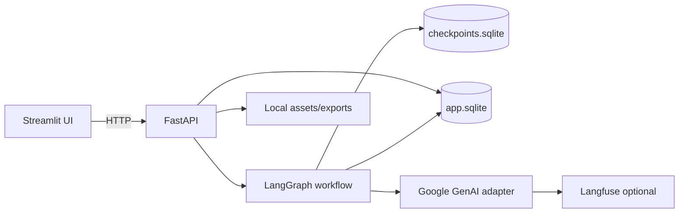

# Maidani Mewari Screenplay Adaptation Studio

A local, single-user AI engineering MVP for structured screenplay extraction, human-approved cultural adaptation, continuity control and visually consistent production assets.

The application implements a durable sequence rather than an open-ended agent:

```text
input → extraction → canonicalization → continuity → approval
      → grounded cultural brief → six-layer plan → approval
      → scene adaptation → surgical corrections → approval
      → visual manifest → approval → character sheets → approval
      → generate scene → approve continuity snapshot → compile next scene → export
```

## What is implemented

- FastAPI backend and six-screen Streamlit UI.
- LangGraph workflow with SQLite checkpoints and human interrupts.
- Versioned structured documents and approvals in a separate SQLite database.
- Canonical scenes, characters, production elements and state records.
- Deterministic continuity checks for missing scenes/metadata, unknown IDs, prop transfers, costumes, knowledge and injuries.
- A source-cited Gemini cultural-research path followed by schema normalization and an explicit Maidani Mewari dialect guide.
- Six independent adaptation layers: verbal, non-verbal, characters, visual world, story world and cultural precision.
- Lossless one-to-one source-block mapping with automatic scene repair and a post-adaptation dialect audit.
- Side-by-side screenplay review and hash-guarded surgical block corrections.
- Editable, versioned visual manifests with in-place model regeneration before image spending.
- One character/costume sheet per appearance and one incrementally approved keyframe per scene.
- Canonical set IDs distinguish a parent location from exact sub-locations, so a farmhouse dining room and veranda cannot silently overwrite one another.
- Just-in-time scene prompts reuse the approved same-set image, immutable character/costume sheets and immediate prior-scene state with labelled reference priority.
- Editable visual-continuity snapshots record geometry, fixed elements, materials, adjacency, movable elements, costumes and props; corrections invalidate only affected downstream work.
- Automated visual verification is advisory at the human gate: a reviewer can accept a false negative with a required audit reason, directly version a scene prompt, or restore a retained image without another generation call.
- Single-asset generation/correction/retry without rebuilding unrelated assets.
- Optional Langfuse observations plus an always-present local AI-usage log.
- ZIP export with screenplay PDFs/text, structured data, reports and images.
- Bundled Noto Sans Devanagari font (SIL Open Font License) for shaped PDF output.
- Deterministic mock mode for tests and demonstrations without external credentials.

The existing `culture-pack/` folder is deliberately not loaded by the runtime.

## Setup

Python 3.11+ is required.

```bash
python3 -m venv .venv
source .venv/bin/activate
python3 -m pip install -e '.[dev,observability]'
cp .env.example .env
```

Mock mode is the default and exercises the complete workflow without claiming cultural accuracy. For live generation, set:

```dotenv
AI_MODE=live
GEMINI_API_KEY=your-key
```

Langfuse is an optional dependency so the core workflow remains installable in restricted environments. Install the `observability` extra and add `LANGFUSE_PUBLIC_KEY` plus `LANGFUSE_SECRET_KEY` to enable traces. Full screenplay content is not captured unless `LANGFUSE_CAPTURE_CONTENT=true`.

## Run

Open two terminals in the repository with the virtual environment active:

```bash
make api
```

```bash
make ui
```

Then open `http://localhost:8501`.

## Test

```bash
make test
```

The tests cover continuity and extraction-metadata failures, lossless block mapping, immutable revisions, idempotency, every LangGraph approval gate, process restart/resume, surgical-edit isolation, canonical sub-location sets, sequential scene unlocking, labelled visual references, per-asset retry and export generation.

Generate the deterministic, credential-free submission sample with:

```bash
make sample
```

The result is written to `sample_output/`. Its screenplay is deliberately source-preserving and its images are visibly labelled mock assets; use live mode for an evidence-grounded cultural adaptation.

## Architecture



The graph state contains revision IDs and hashes. Structured documents are immutable revisions in `app.sqlite`; image bytes stay on disk. Gemini calls are cached by provider, model, prompt version and input hash so a resumed node can reuse a completed response.

See `ARCHITECTURE.md` for the failure/replay model and cultural-safety boundary, and `AI_USAGE.md` for the assignment disclosure.

## Model and prompt policy

- Text model default: `gemini-3.8-flash`.
- Image model default: `gemini-3.1-flash-image`.
- All structured calls use Pydantic response schemas.
- Search grounding runs only while producing the cultural brief.
- Once approved, the brief is frozen and later stages cannot browse.
- Dialogue targets Maidani Mewari in Devanagari; standard Hindi is allowed only through an approved code-switching rule, and Marwari is not treated as a substitute.
- Unsupported dialect detail must be omitted or marked uncertain; insufficient language evidence blocks plan approval unless explicitly overridden.
- Every source block must survive adaptation exactly once and in order. Incomplete scene output is repaired twice, then fails recoverably.
- Story purpose, relationships, causal logic and emotional arc outrank decorative changes.

## Known limitations

- Pasted text and `.txt` input only; no PDF/DOCX ingestion.
- Maidani Mewari, one locality and Devanagari only.
- No native-speaker reviewer is available. The application exposes sources, confidence and uncertainty; it does not claim linguistic certification.
- Mock outputs demonstrate engineering behavior, not cultural accuracy.
- SQLite is intended for a local hiring-assignment demo, not concurrent production traffic.
- Visual verification is prompt/manifest based in the MVP; a live multimodal verifier can be strengthened with an evaluated dataset.
- The PDF renderer depends on an installed Devanagari-capable system font.

## AI usage and privacy

Every model operation records model name, prompt/input hashes, latency, retry status and errors in `app.sqlite`. The export includes `ai_usage_log.json`. Secrets are read from environment variables and are never exported.
